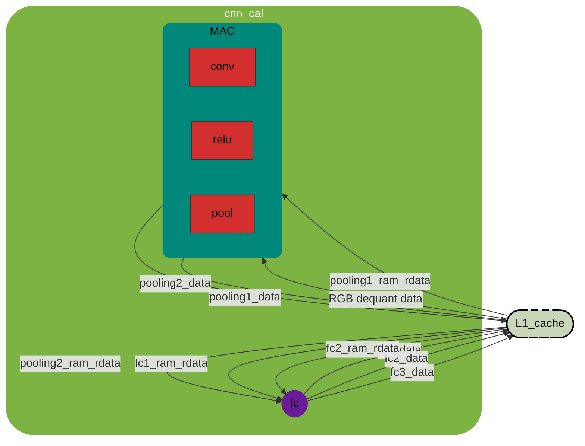

```mermaid
flowchart TD
    subgraph cnn_cal [cnn_cal]
        subgraph MAC [MAC]
            direction LR
            conv[conv]
            relu[relu]
            pool[pool]
        end
        fc([fc])
    end

    L1_cache([L1_cache])

    %% 模块与缓存之间的数据流交互（从左到右严格对应原图的连线）
    L1_cache -- RGB dequant data --> MAC
    MAC -- pooling1_data --> L1_cache
    L1_cache -- pooling1_ram_rdata --> MAC
    MAC -- pooling2_data --> L1_cache

    L1_cache -- pooling2_ram_rdata --> fc
    fc -- fc1_data --> L1_cache
    L1_cache -- fc1_ram_rdata --> fc
    fc -- fc2_data --> L1_cache
    L1_cache -- fc2_ram_rdata --> fc
    fc -- fc3_data --> L1_cache

    %% 样式美化，尽量还原原图的色彩与形状
    style cnn_cal fill:#7cb342,stroke:none,color:#fff,rx:40,ry:40
    style MAC fill:#00897b,stroke:none,color:#000,rx:10,ry:10
    style conv fill:#d32f2f,stroke:#333,stroke-width:1px,color:#000
    style relu fill:#d32f2f,stroke:#333,stroke-width:1px,color:#000
    style pool fill:#d32f2f,stroke:#333,stroke-width:1px,color:#000
    style fc fill:#6a1b9a,stroke:none,color:#000,rx:30,ry:30
    style L1_cache fill:#c8d6b9,stroke:#000,stroke-width:2px,stroke-dasharray: 10 5,color:#000
```
